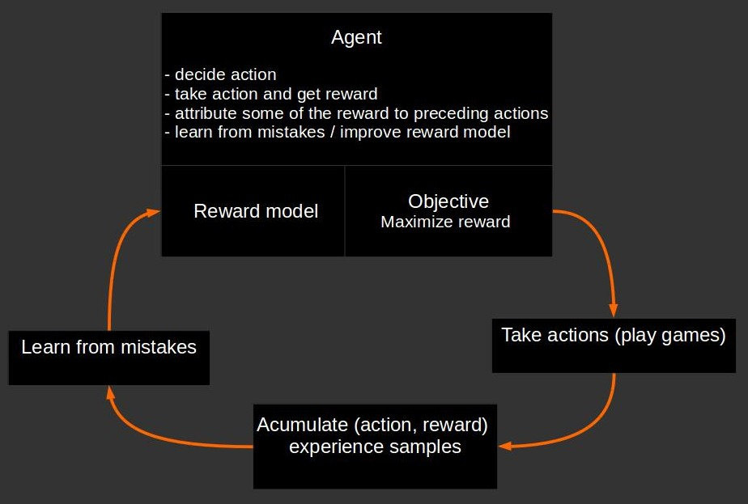
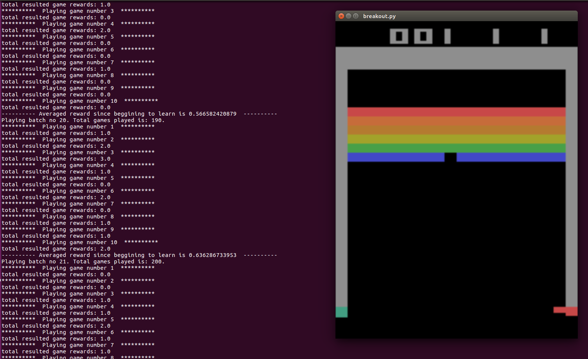

> Reinforcement Learning is probably the most popular multi-agent architecture in ML. It not only proposes a human-like model
for how an agent can be trained and interact with the environment and other agents but it opens the door towards researching on other possible 
multi-model interaction architectures. A recent such innovation were the [GANs](https://arxiv.org/pdf/1406.2661.pdf).

## What is the article about?
Explaining and implementing the equations of one Reinforcement Learning agent in pure python. Explaining the building blocks of an
RL agent. The code for this article is on github [here](https://github.com/hiflyin/Breakout-Reinforcement-Learning-Agent).
The prediction task example is learning to play Breakout game using the [Gym API](https://gym.openai.com/docs/). This is a long 
article so you might want to skip to a specific section:

* [Reinforcement Learning Introduction](#why) 
* [One Agent Component Architecture](#arch)
* [Generic RL agent components explained and pure python code](#components)
* [Training an agent to play the breakout game](#results)
* [Conclusions](#conclusions) <a id="why"></a>

## Reinforcement Learning Introduction
Reinforcement Learning have become very popular in the latest decade because the have opened the door to building 
human-like agents that can learn and interact with each other and/or the environment.

<a id="arch"></a>


## One Agent Component Architecture

A typical RL agent has at its core a reward-model or value-action model for which we can use any prediction or classification model.
It is meant to be trained on vector embeddings/encodings of the actions the agent takes and predict the rewards. 

 

<a id="components"></a>


## Generic Components Implementation in Pure Python

The agent-environment components are mapped to python functions as follows:

* The agent  
1. The reward model: deep neural network with weights dict, feed-forward and backprop functions
2. The actions:     
    decide_next_action(curr_state_change, model)    
    take_next_action(action, environment)   
3. Attributing rewards: 
    attribute_rewards_to_earlier_actions(rewards)
4. Learning from mistakes:      
    compute_model_updates_from_game_mistakes( model, actions_taken, resulted_states_diff, resulted_rewards, model_predictions)      
    learn_from_mistakes(action_value_model, model_upates)

* The environment   
1. take_next_action(action)

* Mapping environment to a game API
1. play_until_game_over(game, model)
2. play_several_games(n_games, game, model)

Below is the corresponding python code for the main components and the simulation results. The rest of the implementation
is on github [here](https://github.com/hiflyin/Breakout-Reinforcement-Learning-Agent)

```python
def decide_next_action(curr_state_change, weights):
    # see what the model says and then decide if to go random or not
    action_value_model_predictions = feed_forward_sample(curr_state_change, weights)
    action = 2 if np.random.uniform() < action_value_model_predictions["prediction_action_2"][0] else 3
    return action, action_value_model_predictions

def take_next_action(action, game):
    game.step(1)
    return game.step(action)

def play_until_game_over(game, model, render= False):
    game_actions_taken = []
    resulted_game_states = [extract_features(game.reset())]
    resulted_game_states_diff = [np.zeros_like(resulted_game_states[-1])]
    resulted_game_rewards = []
    action_value_model_predictions = []
    game_is_over = False
    while(game_is_over == False):
        if render:
            game.render()
            time.sleep(.05)
        action, action_value_model_prediction = decide_next_action(resulted_game_states_diff[-1], model["weights"])
        new_game_state, action_reward, game_is_over, other_info =  take_next_action(action, game)
        # might need extend?
        game_actions_taken.append(action)
        resulted_game_rewards.append(action_reward)
        resulted_game_states.append(extract_features(new_game_state))
        resulted_game_states_diff.append(resulted_game_states[-1] - resulted_game_states[-2])
        action_value_model_predictions.append(action_value_model_prediction)
    print "total resulted game rewards: {}".format(sum(resulted_game_rewards))
    model["historic_avg_reward"] = sum(resulted_game_rewards) if model["historic_avg_reward"] is None else \
        sum(resulted_game_rewards) * 0.01 + model["historic_avg_reward"] * .99

    return game_actions_taken, resulted_game_states_diff, resulted_game_rewards, action_value_model_predictions

def compute_model_updates_from_game_mistakes( weights, actions_taken, resulted_states_diff, resulted_rewards, model_predictions):
    resulted_rewards = attribute_rewards_to_earlier_actions(resulted_rewards)
    # define model targets to correspond to the actions taken
    targets = np.array([1  if x == 2 else 0 for x in actions_taken ])
    # compute model errors as differences between targets and actions's probabilities
    errors = targets - np.array([x["prediction_action_2"][0][0] for x in model_predictions]).flatten()
    # but what we want is to pick the action with best reward
    # if action had positive reward - the larger the reward - the more we want to increase the error accordingly
    # so that we make the model be more sure about taking that action next time and vice-versa for small positive
    # reward - we may want to magnify the error less because maybe other action could have had larger reward
    # so let the model not be so sure..
    # if action had negative reward then we provide a negative error which tells the model the oposite action was better
    # all these are achieved in short by weighting the errors by the rewards:
    errors *= resulted_rewards
    return back_prop_sequence(resulted_states_diff, model_predictions, errors, weights)

def play_several_games(n_games, game, model, render = False):
    # sum up all updates over several games
    all_games_updates = {}
    for k, v in model["weights"].iteritems():
        all_games_updates[k] = np.zeros_like(v)
    for i in range(n_games):
        print "*"*10 + "  Playing game number {}  ".format(i+1) + "*"*10
        model_updates = compute_model_updates_from_game_mistakes(model["weights"], *play_until_game_over(game, model, render))
        render = False
        for k, v in model_updates.iteritems():
            all_games_updates[k] += v
    print "-" * 10 + " Averaged reward since beggining to learn is {}  ".format(model["historic_avg_reward"]) + "-" * 10
    return all_games_updates

def attribute_rewards_to_earlier_actions(rewards):
    for t in range(1,len(rewards)):
        # in some games - when reward is not 0 - it means afterwards it started from scratch
        # so no future rewards from here should be propagated as there's no dependency between actions from here
        # so only when the reward at time t-1 is 0 we attribute some portion gamma of the reward from future to it
        if rewards[-t-1] == 0: rewards[-t-1] = gamma*rewards[-t]
    # finally we standardize the rewards to a common scale
    rewards -= np.mean(rewards)
    if np.std(rewards) != 0:
        rewards /= np.std(rewards)
    return rewards

def learn_from_mistakes(action_value_model, model_upates):
    for k, v in action_value_model["weights"].iteritems():
        action_value_model["rmsprop_grad"][k] = action_value_model["decay_rate"] * action_value_model["rmsprop_grad"][k] + \
                                                (1 - action_value_model["decay_rate"]) * (model_upates[k] ** 2)
        total = action_value_model["learning_rate"] * model_upates[k] / (np.sqrt(action_value_model["rmsprop_grad"][k]) + 1e-5)
        #print total.sum()
        action_value_model["weights"][k] += total
    return action_value_model

def learn_to_play(games_to_play_before_learning_better_actions = 10):
    game = gym.make("Breakout-v0")
    model_to_predict_game_action = define_action_value_model()

    batch_no = 1
    render = False
    while(True):
        if batch_no %10 == 0: render = True
        print "Playing batch no {}. Total games played is: {}. ".format(batch_no,
                                                        (batch_no-1)*games_to_play_before_learning_better_actions)
        needed_action_value_model_updates = play_several_games(games_to_play_before_learning_better_actions, game,
                                                               model_to_predict_game_action, render)
        learn_from_mistakes(model_to_predict_game_action, needed_action_value_model_updates)
        batch_no += 1
        render = False
```

<a id="results"></a>

## Results on the Breakout Game Example
Running the github [code](https://github.com/hiflyin/Breakout-Reinforcement-Learning-Agent) with the components above for Breakout 
trains a model on playing the game. This requires a very large number of iterations. We can see below that after 200 games, 
the agent learned to score 1 point in the game with a running average > .6 points since beginnig to learn.

    python breakout.py 
    Playing batch no 1. Total games played is: 0. 
    **********  Playing game number 1  **********
    total resulted game rewards: 0.0
    **********  Playing game number 2  **********
    total resulted game rewards: 0.0
    **********  Playing game number 3  **********
    total resulted game rewards: 1.0
    **********  Playing game number 4  **********
    total resulted game rewards: 1.0
    **********  Playing game number 5  **********
    total resulted game rewards: 1.0
    **********  Playing game number 6  **********
    total resulted game rewards: 1.0
    **********  Playing game number 7  **********
    total resulted game rewards: 2.0
    **********  Playing game number 8  **********
    total resulted game rewards: 3.0
    **********  Playing game number 9  **********
    total resulted game rewards: 1.0
    **********  Playing game number 10  **********
    total resulted game rewards: 2.0
    ---------- Averaged reward since beggining to learn is 0.116560295572  ----------
    Playing batch no 2. Total games played is: 10. 
    **********  Playing game number 1  **********
    total resulted game rewards: 0.0
    **********  Playing game number 2  **********
    total resulted game rewards: 1.0
    **********  Playing game number 3  **********
    total resulted game rewards: 2.0
    **********  Playing game number 4  **********
    total resulted game rewards: 0.0
    **********  Playing game number 5  **********
    total resulted game rewards: 0.0
    **********  Playing game number 6  **********
    total resulted game rewards: 0.0
    **********  Playing game number 7  **********
    total resulted game rewards: 0.0
    **********  Playing game number 8  **********
    total resulted game rewards: 1.0
    **********  Playing game number 9  **********
    total resulted game rewards: 2.0
    **********  Playing game number 10  **********
    total resulted game rewards: 0.0
    ---------- Averaged reward since beggining to learn is 0.162884795876  ----------
    Playing batch no 3. Total games played is: 20. 
    
 

<a id="conclusions"></a>


## Conclusions 

Building a simple RL agent is a rather easy task. However it makes one understand the abstract components or building blocks 
involved so that one can further optimize and add complexity to them individually.