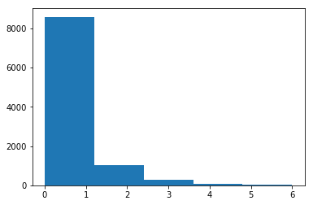

> Most innovation in Machine Learning regression algorithms assumes a response with gaussian distribution and little research is
directed towards other classes of distribution. Despite hurdles such as model interpretation and deeply ingrained industry standards, 
non-linear models have recently started to replace the linearity assumptions of traditional GLMs.

## What is the article about?

Implementing a neural network to model a Poisson Distribution. Explaining the basics of Poisson regression with constant exposure,
providing a mathematical proof for the equivalence between optimizing the log-likelihood for Poisson regression with constant exposure
and optimizing the log-likelihood for Poisson regression with variable exposure while weighting the samples by the variable exposure.
Training a neural network model in Keras for a randomly generated sample representing the number of times patients return to GP 
after variable exposure to prescribed treatments. The code for this article is on github [here](https://github.com/hiflyin/Regression-of-Non-Gaussian-Distributions-with-Deep-Learning). 

* [Poisson regression with constant exposure](#why) 
* [Proof for Poisson regression with variable exposure](#proof)
* [Training a Poisson Neural Network for variable exposure data](#code)
* [Conclusions](#conclusions) <a id="why"></a>

## Poisson regression with constant exposure 
We assume that the events occur at an average rate of some value  *&lambda;* per unit time (day/month/time unit). 
This means that the probability of *y* events in a time unit follows a Poisson Distribution:

<table class="equation"><tr><td><center class="math-display"><a id="x1-2r1"></a></center></td><td class="equation-label">(1)</td></tr></table>
 
where *&lambda;* is the average event rate we assumed.      
Our task is to find *&lambda;* of this distribution based on data we have so that we can then compute
*P(y events in time unit)*. Poisson distribution assumes that *&lambda;* can be modeled as a function *f(X)* of features 
*X*, describing the event exposure. For simplicity of the proof we choose a linear model
*f(X) = &theta;<sub>0</sub> + &theta;<sub>1</sub>x<sub>1</sub> + &theta;<sub>2</sub>x<sub>2</sub> + .. = &Theta;<sup>t</sup>X*
depending on some parameters *&Theta;*. In reality, we replace this with more complex models such as decision trees or neural 
networks in which case we show that the following proof about variable exposure still holds. So we search for best *&Theta;* 
for the following regression, assumed by the Poisson distribution:      
<table class="equation"><tr><td><center class="math-display"><a id="x1-3r2"></a></center></td><td class="equation-label">(2)</td></tr></table>       
where *'E'* is the expectation of *y* events given data features *X*, that is the average number of events in a 
unit of time, given *X*. So when replacing *&lambda;* in eq. 1 with our estimate of *&lambda;* based on the data
*X* as in the eq. above, we get:        
<table class="equation"><tr><td><center class="math-display" >
<a id="x1-4r3"></a></center></td><td class="equation-label">(3)</td></tr></table>        
We consider the data *X* to be made of *N* data points *x<sub>1</sub>, x<sub>2</sub>,.., x<sub>N</sub>*. The probability of the whole 
data is then the product of probability of each point in the data:      
<table class="equation"><tr><td><center class="math-display" ><a 
 id="x1-5r4"></a></center></td><td class="equation-label">(4)</td></tr></table>     
Our aim is to maximize the probability above and we do this by maximizing the likelihood of *&Theta;* given our event counts 
*Y* and our features *X*, that is *L(&Theta;|Y,X)*. This is the same as maximizing the logarithm
of *L(&Theta;|Y,X)*, which we actually use in practice because it turns the product in the eq. above into a
summation as *log(ab) = log(a) + log(b)* and *log(e<sup>x</sup>) = x*:      
<table class="equation"><tr><td><center class="math-display" >
<a id="x1-6r5"></a></center></td><td class="equation-label">(5)</td></tr></table>       
<table class="equation"><tr><td><center class="math-display" >
<a id="x1-7r6"></a></center></td><td class="equation-label">(6)</td></tr></table>       
Note that by removing *log(y<sub>i</sub>)*  we have only kept the part of the log-likelihood that depends
on the *&Theta;* because the rest does not influence the process of optimizing for best the parameters. 
<a id="proof"></a>

## Proof for Poisson regression with variable exposure

If we assume that events come at an average *&lambda;* per time unit then we can also say that in *p* time units we would
get an average of *p&lambda;* events. *p* is our exposure. This means that the probability of *y* events in *p* time units, follows 
the poisson distribution:       
<table class="equation"><tr><td><center class="math-display" >
<a id="x1-8r7"></a></center></td><td class="equation-label">(7)</td></tr></table>       
where *&lambda;* is still the average event rate per time unit we assumed (but we have just multiplied it by *p*,
following a Poisson distribution and implying:  = 
*E(y|x) = e<sup>&theta;X</sup>*. So when replacing *&lambda;* in the eq. above with our estimate  based on the data *X* we get:       
<table class="equation"><tr><td><center class="math-display" ><a id="x1-9r8"></a></center></td>
<td class="equation-label">(8)</td></tr></table>        
and our variable exposure log-likelihood of the data looks like this (same steps as for one time unit exposure and with removing 
terms which don't depend on *&Theta;*):     
<table class="equation"><tr><td><center class="math-display" ><a id="x1-10r9"></a></center></td><td class="equation-label">(9)</td></tr></table>      
by bringing *p<sub>i</sub>* in the front of each summation term above as a weight, the eq. above can also be written as:        
<table class="equation"><tr><td><center class="math-display" ><a id="x1-11r10"></a></center></td><td class="equation-label">(10)</td></tr></table>        
Note that  is basically counts devided by exposure 
or what we call frequency. So it turns out that if we optimize the log-likelihood of the frequency and weight the
likelihood of each data point by its exposure *p<sub>i</sub>*it is the same as optimizing for the log-likelihood of the
event counts when we have the variable exposure, *p<sub>i</sub>*. Also note that if we replace in the above eq. *&Theta;<sup>t</sup>X*
with other non-linear functions (e.g. a complex polynom), the conclusion about the likelihood still holds.
<a id="code"></a>

## Training a Poisson Neural Network for variable exposure data

### Story: 
Let's assume our aim is to predict the frequency with which patients under GP treatment prescription return to the practice during the
course of the treatment because the symptoms don't improve. The exposure to the treatment is variable. We would like to predict
this frequency based on the age of the patients.

### Generating data for Poisson distribution with variable exposure

We generate 10000 random samples and measure the variable exposure in weeks

```python
import numpy as np
w0 = -3
w1 = .001
n = 10000
age = np.random.randint(18, 56, size=n)
n_weeks = np.random.randint(1, 24, size=n)
lambda_ = np.exp(w0 + w1*age)
lambda_n_weeks = n_weeks*lambda_
y = np.random.poisson(lam=lambda_n_weeks)

import matplotlib.pyplot as plt
count, bins, ignored = plt.hist(y, 5)
plt.show()
```



### Training a Poisson Neural Network for variable exposure data

Below is the main code of the implementation and the output. The full code on github [here](https://github.com/hiflyin/Regression-of-Non-Gaussian-Distributions-with-Deep-Learning). 
We fit a neural net with one hidden dense layer and exponential activation for the output layer.
We weight the samples by the variable exposure and optimize for the poisson loss.

```python
from keras.models import Model
from keras.layers import Input, Dense, Lambda
from keras.optimizers import Adam
from keras import backend as K
import numpy as np

w0 = -3
w1 = .001
n = 10000
age = np.random.randint(18, 56, size=n)
n_weeks = np.random.randint(1, 24, size=n)
lambda_ = np.exp(w0 + w1*age)
lambda_n_weeks = n_weeks*lambda_
y = np.random.poisson(lam=lambda_n_weeks)

inputs = Input(name='input1', shape=(1,))
hidden = Dense(5, activation='relu')(inputs)
outputs = Dense(1, activation=Lambda(lambda x: K.exp(x)))(hidden)
model = Model(inputs=inputs, outputs=outputs)
model.compile(loss='poisson',optimizer=Adam(lr=.01))

model = model.fit([age], y, batch_size=1000, nb_epoch=30, validation_split=0.1, sample_weight = n_weeks)
```

    Epoch 25/30
    9000/9000 [==============================] - 0s - loss: 11.7513 - val_loss: 11.7840
    Epoch 26/30
    9000/9000 [==============================] - 0s - loss: 11.7445 - val_loss: 11.7674
    Epoch 27/30
    9000/9000 [==============================] - 0s - loss: 11.7427 - val_loss: 11.7745
    Epoch 28/30
    9000/9000 [==============================] - 0s - loss: 11.7419 - val_loss: 11.7712
    Epoch 29/30
    9000/9000 [==============================] - 0s - loss: 11.7429 - val_loss: 11.7757
    Epoch 30/30
    9000/9000 [==============================] - 0s - loss: 11.7398 - val_loss: 11.7547

<a id="conclusions"></a>

## Conclusions

We can train Neural Network models for the variable exposure Poisson Distribution by optimizing for the log-likelihod of the 
frequency and weighting by the sample exposure. Transitioning from GLMs to deep learning models requires the adequate activation 
 of the output layer - in this case choosing an exponential was right.

    


        
___
