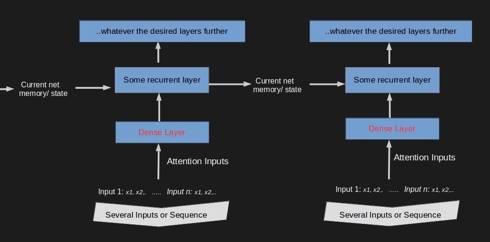
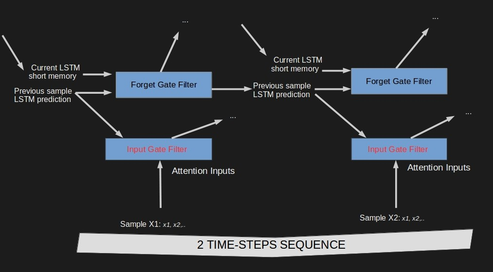
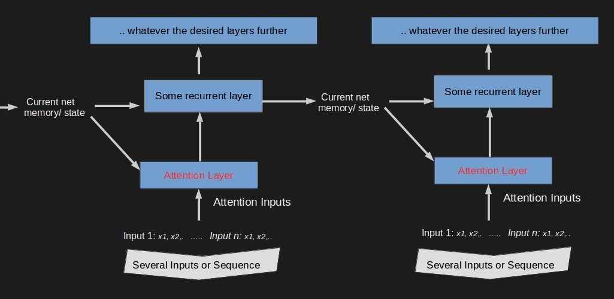
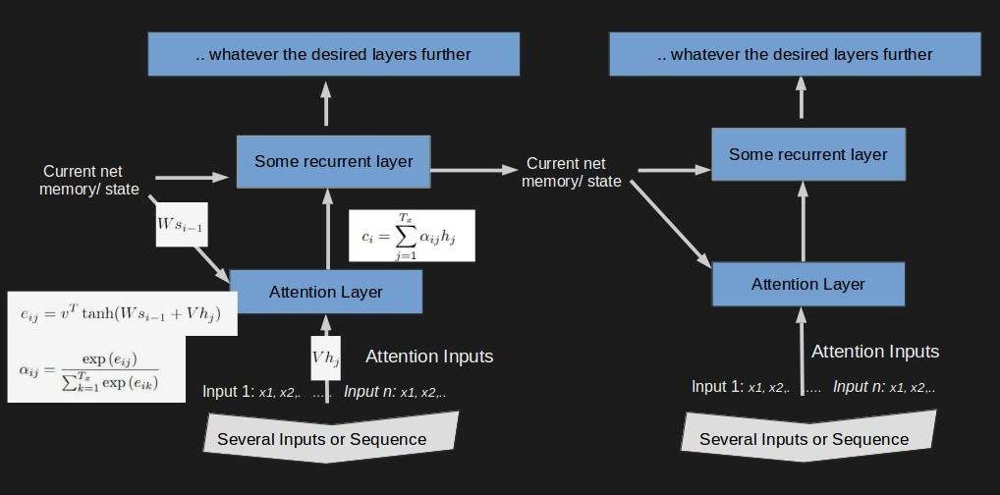
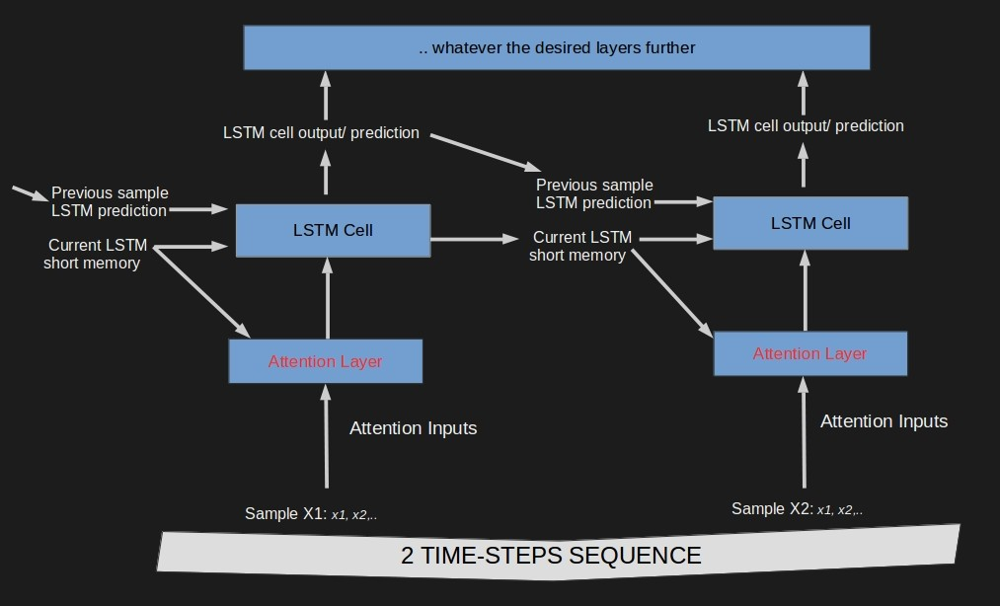
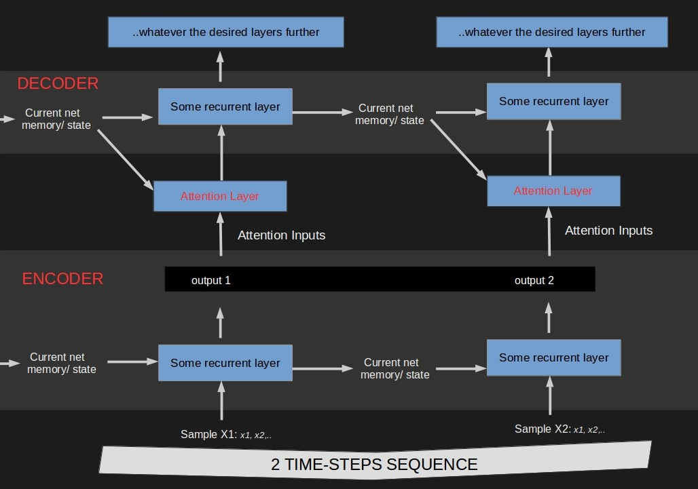
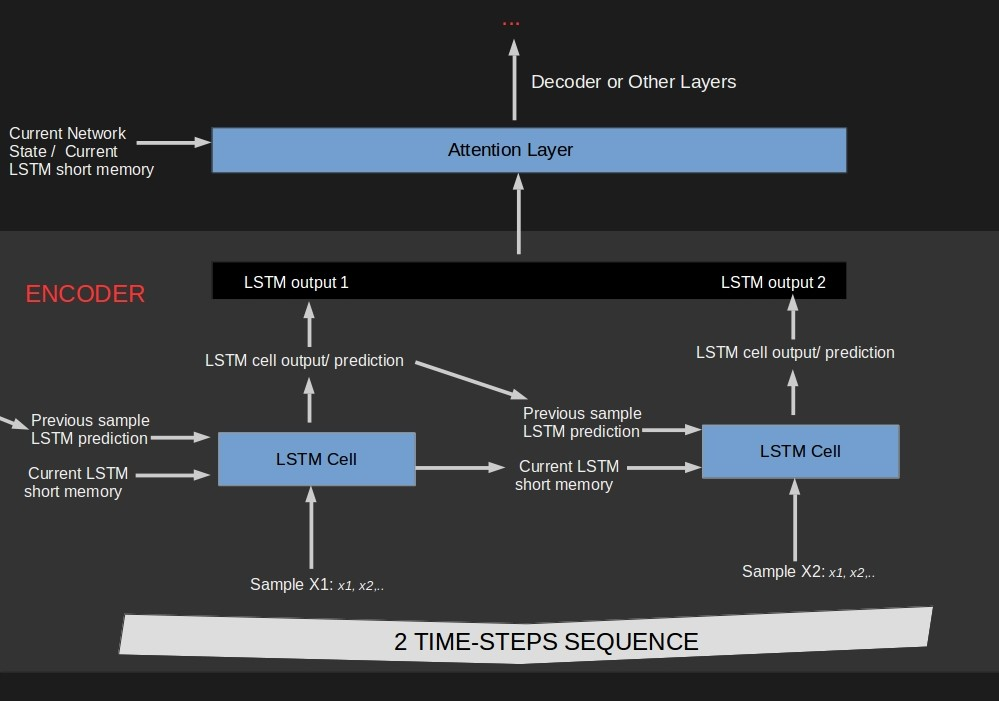
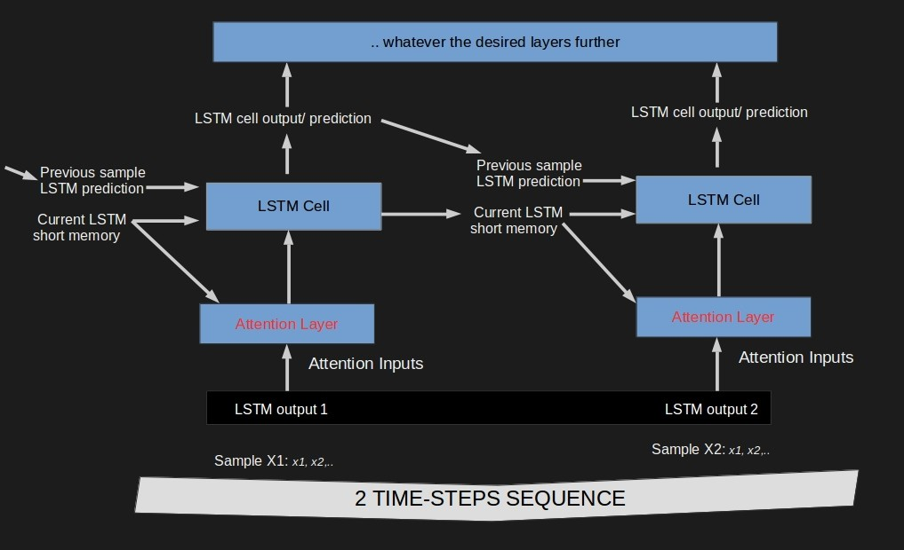

>  We used to extract features for a whole dataset at once. Now we also extract features customized for the very current prediction.
We can be picky because we have expanded our short memory capacity.

## What is the article about?
The focus of the article is on understanding the concept and building components of the attention mechanism and comparing it with 
other concepts. We explain and implement the equations of a plain attention network in pure python. 
For advanced applications of attention mechanism, [bricks library](https://blocks.readthedocs.io/en/latest/api/bricks.html?highlight=attention#module-blocks.bricks.attention) 
for example, already provides an API to facilitate implementing it.
This is a long article so you might want to skip to a specific section:

* [Attention Concept Introduction](#why) 
  * [Comparison Between Simple Dense Layer and Attention Dense Layer](#why2) 
  * [Comparison Between Attention Layer and LSTM input gate filter](#why3) 
* [Generic Attention Mechanism for An RNN](#architectures1)
* [Generic Attention Mechanism for An LSTM](#architectures2)
* [Attention in the Translation Encoder-Decoder Model](#components)
* [Conclusions](#conclusions) 

## Attention Concept and Mechanism Introduction
The attention concept and mechanism where introduced in [a paper](https://arxiv.org/pdf/1409.0473.pdf) focused on the problem of
learning to translate. Several further developments exploring and expanding the idea were published.
The attention mechanism is build around the RNN architecture: there are two ideas surrounding it:

1) instead outputing several predictions by looking at a sequence of inputs one by one (that is usually a memory of the sequence so far
and a next element in the sequence) we could just look at the sequence as a whole every time and let the model pick/ weight which 
element in that sequence is more important for each prediction. The mechanism of looking at the whole sequence at once is specific to
encoder-decoder models.     
2) the RNN network current inner state or short-term memory could be used to decide on how to weight the inputs of the next sample.
 
To better understand the above, we compare weighting the inputs using the attention weight with  the following:

1) weighting the inputs with a simple dense layer   
2) weighting the inputs using an LSTM input gate

### Comparison Between Simple Dense Layer and Attention Dense Layer

A dense layer or 1D convolution layer, can be seen as a plain feature extraction. It is one way we could weight the inputs to
give more attention to some than other. However, this dense layer cannot be customized for the current prediction as it has no 
information about the context of what are trying to predict. It is not using the available state of the network nor information 
about what was predicted this far in the sequence.

 
    

### Comparison Between Attention Layer and LSTM Input Gate Filter

If we look closely, the LSTM input gate mechanism does combine the current network state, previous prediction and the current input 
to customize a final input for the current prediction. However, a main distinctive idea here is that the input is not selected
from the whole sequence while in the attention mechanism we weight as whole sequence as input.

 

## Generic Attention Mechanism for an RNN

 

 

## Generic Attention Mechanism for an LSTM

 

## Attention in the Encoder-Decoder Model

 

 

 

## Conclusions 

Attention mechanisms have promising results and are a natural building block over the concept of short-term memory.
Although this concept has been mainly applied in translation - the possibilities for its use and expansion are only yet to be explored.

        
___