> Building on [Vanilla RNNs](/vanilla_RNN.html), LSTMs repesent a new milestone by proposing a mechanism 
of **separating** two tasks in a deep learning architecture: 1) predict for the current sample, and  2) memorize useful
 information for future samples. 

## What is the article about?
Explaining and implementing the equations of a plain vanilla LSTM network in pure python. Explaining the building blocks of an
LSTM and potential architectures. The code for this article is on [github here](https://github.com/hiflyin/Vanilla-LSTM/blob/master/lstm.py).
This article builds on the previous one about [generic RNN](/vanilla_RNN.html)
The prediction task example is learning the sum of two numbers. This is a long article so you might want to skip to a 
specific section:

* [LSTMs Introduction](#why) 
* [Architectures for wiring the LSTM block outputs](#architectures1)
* [Ways to wire the inside components of an LSTM block](#architectures2)
* [Generic LSTM block components explained and pure python code](#components)
* [One sample feed-forward and backpropagation through time](#one_sample)
* [Two samples sequence feed-forward and backpropagation through time](#one_sequence)
* [Putting together the individual code components](#code_structure)
* [Training the network to add two numbers in binary](#results)
* [Conclusions](#conclusions) <a id="why"></a>

## LSTMs Introduction
Recurrent Neural Networks have become very popular in the latest decade because they have opened the door to embedding 
short memory and attention into deep neural networks. LSTMs represent one of the most sophisticated types of RNN because they
output two distinct streams of information: 1) prediction for the current sample, and  2) useful memory information for future samples. 
<a id="architectures1"></a>

## Architectures for wiring the LSTM block outputs
Similar to any form of RNNs, LSTMs take sequences as inputs and the main distinguishing feature among potential architectures 
is the way the outputs of the time-steps in the sequence are combined. 3 prevalent architectures for sequences consisting of 2 
time steps are shown below.


1.Each time-step has a separate output as part of the final label. To see how the LSTM separates the two outputs we show the RNN version
for this type architecture first.

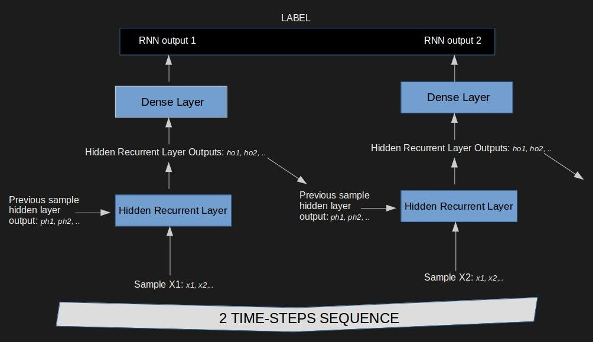 

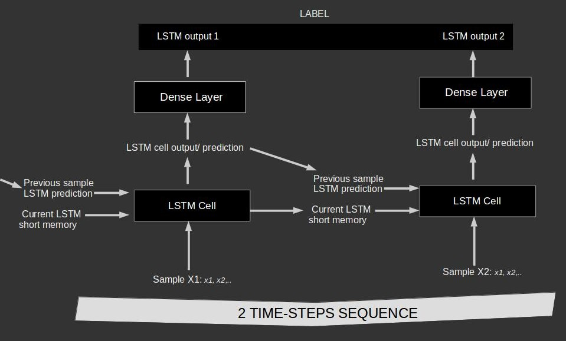

2.Each time-step has a separate output combined in the following layer.

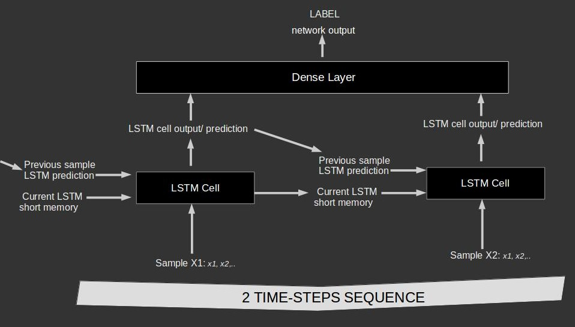

3.Each time-step inputs only into the next time-step and only the last time-steps inputs into the next layer.

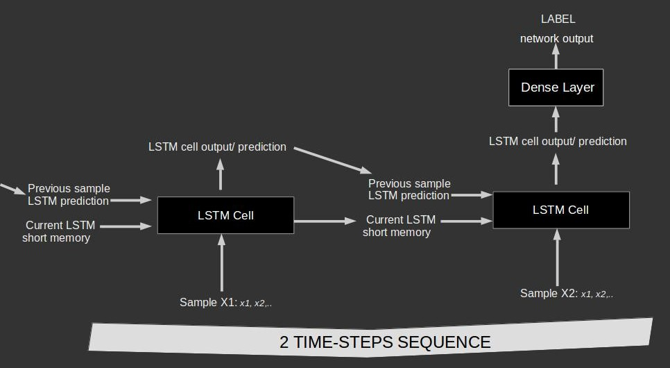

Note that by sample we refer to one time-step of the sequence. For example, if we want to classify text sentences, then each
word is a sample. <a id="components"></a>

<a id="architectures2"></a>

## Ways to wire the inside components of an LSTM block

LSTMs have been an active area of research and several internal architectures have been proposed. A recent review can be
found  [here](https://arxiv.org/pdf/1503.04069.pdf). The authors of this research did not find a significant difference in performance between the different 
proposed LSTM cell types.

The most simple working architecture is below:

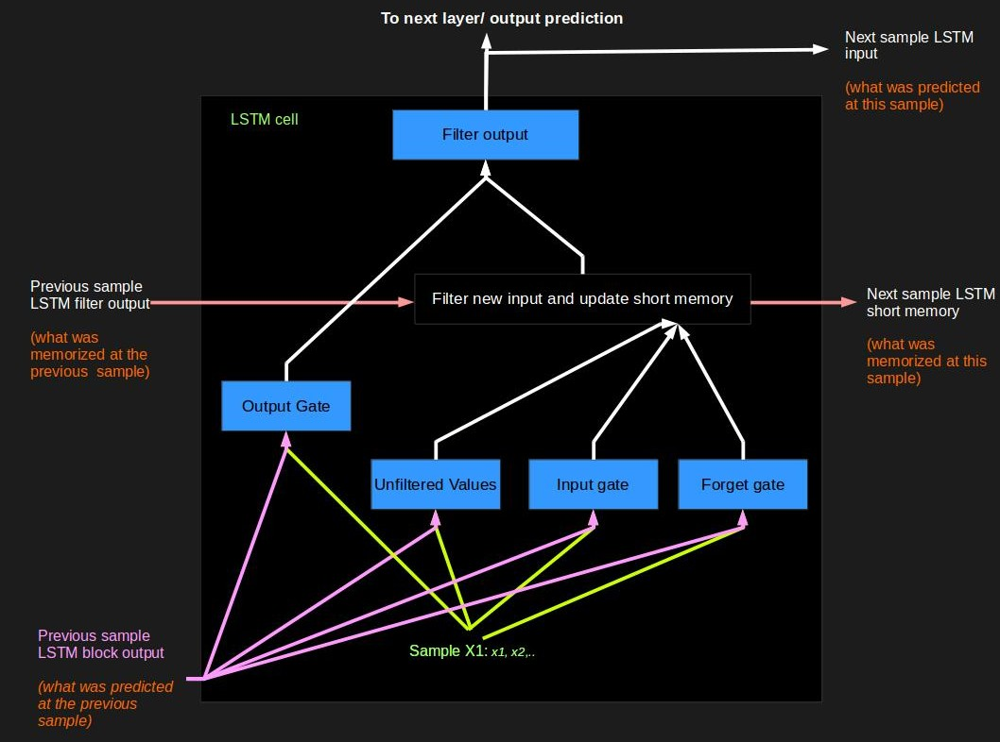

<a id="components"></a>


## Generic LSTM block components in pure python

We implement the components shown in the architecture above. For simplicity we store all weights and parameters in 
python dictionaries. The generic LSTM cell structure and the functions for feeding information forward and errors backwards
are show below. To simplify the components more, the bias term were omitted from the feed-forward and back-prop equations however,
they were included in the python code.

### Unfiltered Values: Raw cell input

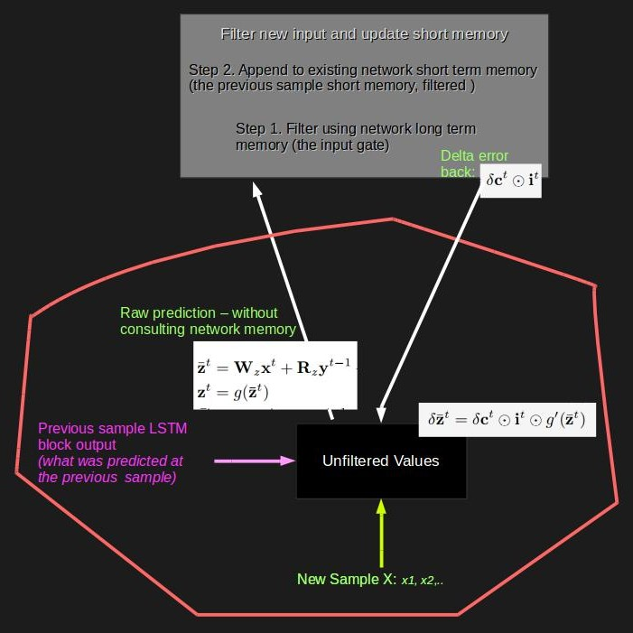

```python
def feed_forward_to_lstm_unfiltered(inputs, weights):
    return {"activation": tanh(np.dot(inputs["from_input"], weights["input_to_lstm_unfiltered"]) +
                            np.dot(inputs["from_previous_lstm"],weights["previous_lstm_output_to_lstm_unfiltered"]) +
                            weights["lstm_unfiltered_bias"])}
```

### Input Gate

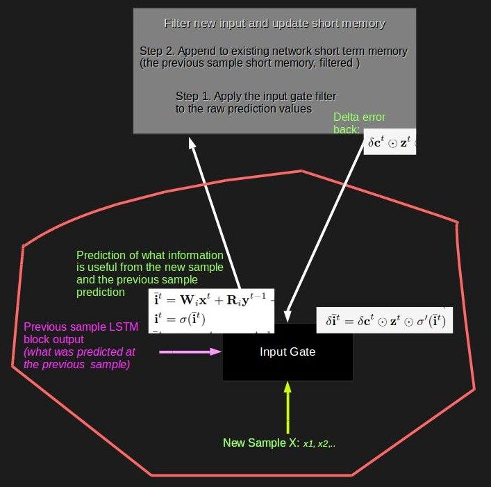

```python

def feed_forward_to_input_gate(inputs, weights):
    return {"activation": sigmoid(np.dot(inputs["from_input"], weights["input_to_input_gate"]) +
                                np.dot(inputs["from_previous_lstm"], weights["previous_lstm_output_to_input_gate"]) +
                                weights["input_gate_bias"])}
```

### Output Gate

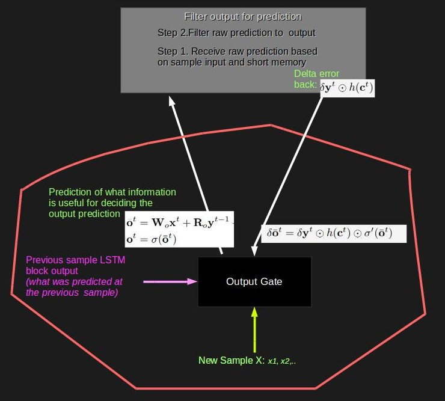

```python

def feed_forward_to_output_gate(inputs, weights):
    return {"activation": sigmoid(np.dot(inputs["from_input"], weights["input_to_output_gate"]) +
                                np.dot(inputs["from_previous_lstm"], weights["previous_lstm_output_to_output_gate"]) +
                                weights["output_gate_bias"])}

```

### Forget Gate

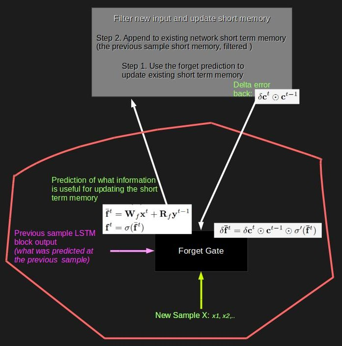

```python
def feed_forward_to_forget_gate(inputs, weights):
    return {"activation": sigmoid(np.dot(inputs["from_input"], weights["input_to_forget_gate"]) +
                                np.dot(inputs["from_previous_lstm"], weights["previous_lstm_output_to_forget_gate"]) +
                                weights["forget_gate_bias"])}
```

### Sort memory filter

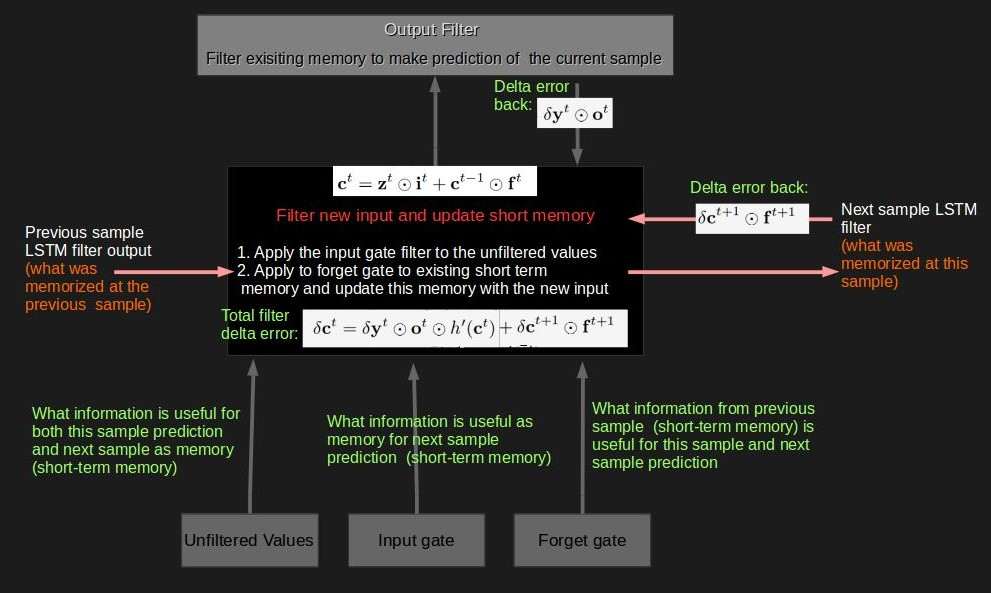

```python
def feed_forward_through_lstm_filter(inputs, weights):

    unfiltered_values = feed_forward_to_lstm_unfiltered(inputs, weights)["activation"]
    input_gate = feed_forward_to_input_gate(inputs, weights)["activation"]
    forget_gate = feed_forward_to_forget_gate(inputs, weights)["activation"]

    return tanh(unfiltered_values*input_gate + forget_gate * inputs["from_previous_lstm_filter"])

```

### Output filter

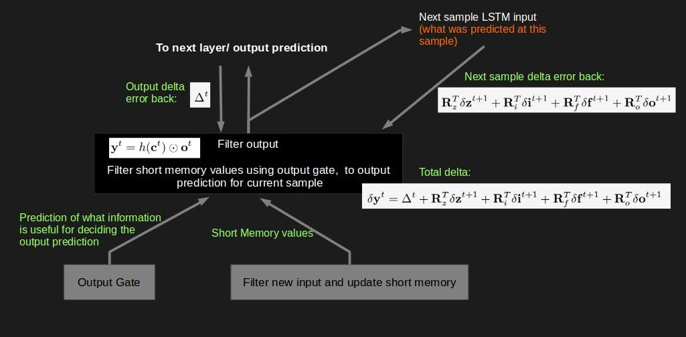

```python
def feed_forward_through_output_gate(inputs, weights):
    filtered_input = feed_forward_through_lstm_filter(inputs, weights)
    output_gate = feed_forward_to_output_gate(inputs, weights)
    return filtered_input*output_gate["activation"]

```

<a id="one_sample"></a>

## One sample feed-forward and backpropagation through time

Below are the functions used to pass one single step/sample of a multi-step sequence through the network. For example, if 
we want to predict the intent of a question then each word is a step in the sequence.

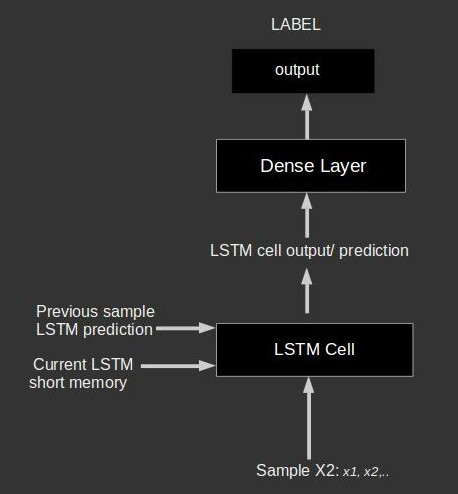

```python
def feed_forward_network(inputs, weights):

    unfiltered_values = feed_forward_to_lstm_unfiltered(inputs, weights)
    input_gate = feed_forward_to_input_gate(inputs, weights)
    forget_gate = feed_forward_to_forget_gate(inputs, weights)
    filtered_values = feed_forward_through_lstm_filter(inputs, weights)
    output_gate = feed_forward_to_output_gate(inputs, weights)
    lstm_output = feed_forward_through_output_gate(inputs, weights)
    dense = feed_forward_dense_layer(inputs, weights)
    return {"input": inputs,
            "unfiltered": unfiltered_values,
            "input_gate": input_gate,
            "forget_gate" : forget_gate,
            "filter" : filtered_values,
            "output_gate" : output_gate,
            "lstm" : lstm_output,
            "dense": dense}
            
 def back_prop_sample(inputs, all_layer_outputs, next_sample_outputs, target, next_sample_deltas, weights):
    error_output = all_layer_outputs["dense"]["activation"] - target
    total_delta = sigmoid_derivative(all_layer_outputs["dense"]["activation"]) * error_output
    dense_deltas = {"total_delta": total_delta,
                    "input_w_delta": np.dot( all_layer_outputs["lstm"].T, total_delta)}
    lstm_deltas = {"total_delta": dense_deltas["total_delta"] +
                                  np.dot(next_sample_deltas["input_gate"]["total_delta"], weights[
                                      "previous_lstm_output_to_input_gate"].T) +
                                  np.dot(next_sample_deltas["forget_gate"]["total_delta"], weights[
                                      "previous_lstm_output_to_forget_gate"].T) +
                                  np.dot(next_sample_deltas["output_gate"]["total_delta"], weights[
                                      "previous_lstm_output_to_output_gate"].T) +
                                  np.dot(next_sample_deltas["unfiltered"]["total_delta"], weights[
                                      "previous_lstm_output_to_lstm_unfiltered"].T)}

    total_delta = lstm_deltas["total_delta"] * all_layer_outputs["filter"] * \
                  sigmoid_derivative(all_layer_outputs["output_gate"]["activation"])
    output_gate_delta = {"total_delta": total_delta,
                          "input_w_delta": np.dot(inputs["from_input"].T, total_delta),
                          "previous_lstm_w_delta": np.dot(inputs["from_previous_lstm"].T, total_delta)}

    filter_delta = {"total_delta": lstm_deltas["total_delta"] * all_layer_outputs["output_gate"]["activation"] *
                                    tanh_derivative(all_layer_outputs["filter"]) +
                                    next_sample_deltas["filter"]["total_delta"] *
                                    next_sample_outputs["forget_gate"]["activation"]}

    total_delta = filter_delta["total_delta"] * all_layer_outputs["unfiltered"]["activation"] * \
                  sigmoid_derivative(all_layer_outputs["input_gate"]["activation"])
    input_gate_delta = {"total_delta": total_delta,
                         "input_w_delta": np.dot(inputs["from_input"].T, total_delta),
                         "previous_lstm_w_delta": np.dot(inputs["from_previous_lstm"].T, total_delta)}

    total_delta = filter_delta["total_delta"] * next_sample_deltas["forget_gate"]["total_delta"] * \
                  sigmoid_derivative(all_layer_outputs["forget_gate"]["activation"])
    forget_gate_delta = {"total_delta": total_delta,
                          "input_w_delta": np.dot(inputs["from_input"].T, total_delta),
                          "previous_lstm_w_delta": np.dot(inputs["from_previous_lstm"].T, total_delta)}
    total_delta = filter_delta["total_delta"] * all_layer_outputs["input_gate"]["activation"] * \
                  sigmoid_derivative(all_layer_outputs["unfiltered"]["activation"])
    unfiltered_delta = {"total_delta": total_delta,
                         "input_w_delta": np.dot(inputs["from_input"].T, total_delta),
                         "previous_lstm_w_delta": np.dot(inputs["from_previous_lstm"].T, total_delta)}

    return {"dense": dense_deltas,
            "output_gate": output_gate_delta,
            "filter": filter_delta,
            "input_gate": input_gate_delta,
            "forget_gate": forget_gate_delta,
            "unfiltered": unfiltered_delta,
            "lstm": lstm_deltas}

```

<a id="one_sequence"></a>

## Two sample sequence feed-forward and backpropagation through time

Below are the functions used to pass the entire sequence through the LSTM net. 


```python
def feed_forward_sequence(inputs_seq, weights):

    all_samples_output_seq = [{"filter": inputs_seq[0]["from_previous_lstm_filter"],
                               "lstm": inputs_seq[0]["from_previous_lstm"]}]
    for input_unit in inputs_seq:
        input_unit["from_previous_lstm"] = all_samples_output_seq[-1]["lstm"]
        input_unit["from_previous_lstm_filter"] = all_samples_output_seq[-1]["filter"]
        all_samples_output_seq.append(feed_forward_network(input_unit, weights))
    return all_samples_output_seq[1:]
    
def back_prop_sequence(inputs_seq, outputs_seq, target_seq, weights):

    deltas_seq = [{"unfiltered": {"total_delta": np.zeros((1, recurrent_size))},
                            "input_gate": {"total_delta": np.zeros((1, recurrent_size))},
                            "forget_gate": {"total_delta": np.zeros((1, recurrent_size))},
                            "output_gate": {"total_delta": np.zeros((1, recurrent_size))},
                            "dense": {"total_delta": np.zeros((1, recurrent_size))},
                            "filter": {"total_delta": np.zeros((1, recurrent_size))}}]
    outputs_seq.append({"forget_gate": {"activation": np.zeros((1,recurrent_size)) } })
    for i in range(1, len(inputs_seq) + 1):
        deltas_seq.append(back_prop_sample(inputs_seq[-i], outputs_seq[-i-1], outputs_seq[-i], target_seq[-i],
                                           deltas_seq[-1], weights))
    outputs_seq.pop()
    weights["log_loss"] += compute_loss_seq(target_seq, [x['dense']['activation'][0][0] for x in outputs_seq])
    return deltas_seq[1:]
    
```

<a id="code_structure"></a>

## Putting together the individual code components

To train a simple example we  just need to ensemble the individual generic components described above. The pseudocode
of the main function is as follows:

    for each sequence do:
        feed_forward_sequence()
        backpropogate_sequence()
        update_weights()
        
The function for updating the weights is trivial. Implementing gradient descent requires simply adding up the delta 
updates from all steps in the sequence.

<a id="results"></a>

## Training the network to add two numbers in binary

For a simple binary addition task an LSTM may need more samples to optimize the weights than a simple RNN. This could be explained
by the fact that the model is more complex, has more weights to optimize for in total and is more prone to overfitting.

    $ python lstm.py 
    ######################################################## sample 1000 
    loss is 0.689197599873
     For training sample: 79 + 83 = 162
     Result is 80.0
    ######################################################## sample 2000 
    loss is 0.661261403703
     For training sample: 12 + 72 = 84
     Result is 76.0
    ######################################################## sample 3000 
    loss is 0.664219946056
     For training sample: 60 + 29 = 89
     Result is 7.0
    ######################################################## sample 4000 
    loss is 0.666338088875
     For training sample: 24 + 75 = 99
     Result is 3.0
    ######################################################## sample 5000 
    loss is 0.666256633986
     For training sample: 112 + 71 = 183
     Result is 247.0
    ######################################################## sample 6000 
    loss is 0.665410203685
     For training sample: 99 + 69 = 168
     Result is 132.0
    ######################################################## sample 7000 
    loss is 0.65836091879
     For training sample: 104 + 0 = 104
     Result is 232.0
    ######################################################## sample 8000 
    loss is 0.648263660515
     For training sample: 93 + 96 = 189
     Result is 253.0
    ######################################################## sample 9000 
    loss is 0.641098444428
     For training sample: 11 + 108 = 119
     Result is 247.0
    ######################################################## sample 10000 
    loss is 0.623564182804
     For training sample: 33 + 106 = 139
     Result is 139.0
    ######################################################## sample 11000 
    loss is 0.600943264931
     For training sample: 43 + 101 = 144
     Result is 144.0
    ######################################################## sample 12000 
    loss is 0.57560596988
     For training sample: 95 + 66 = 161
     Result is 161.0
    ######################################################## sample 13000 
    loss is 0.548084503823
     For training sample: 26 + 19 = 45
     Result is 45.0
    ######################################################## sample 14000 
    loss is 0.522335347754
     For training sample: 113 + 85 = 198
     Result is 198.0

<a id="conclusions"></a>


## Conclusions 

Building a simple LSTM leads to a better understanding of the abstract components or building blocks 
involved in this architecture so that one can further optimize and add complexity to them individually. It is also evident that even a 
simple LSTM can be wired in so many different ways, leading to completely distinct architectures, suitable for different
tasks.


        
___