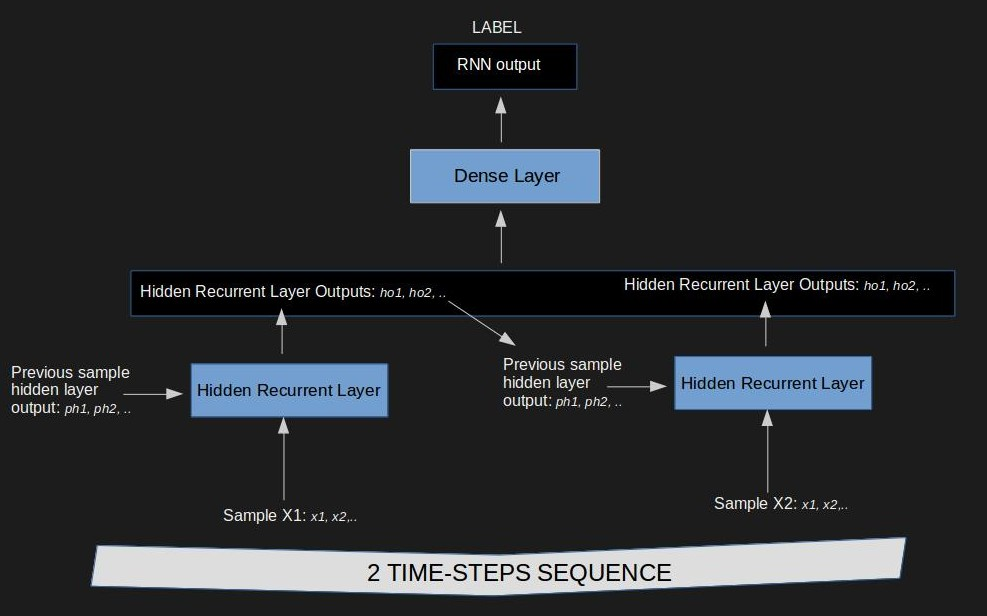
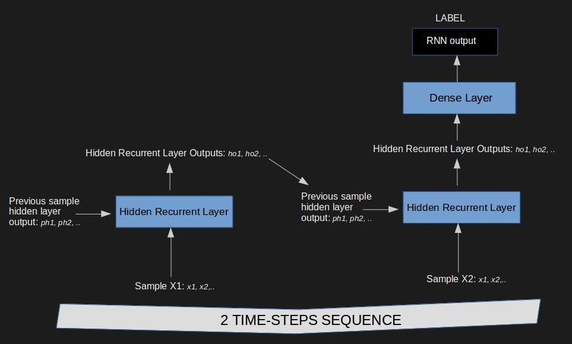
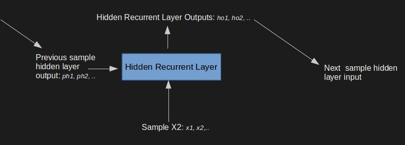
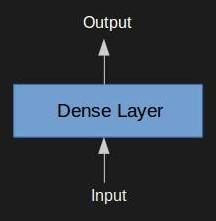
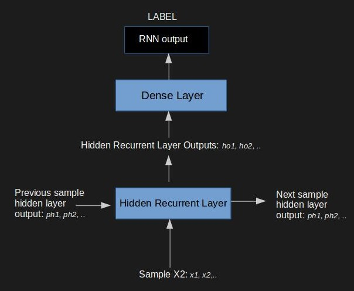

> The simple RNN idea was not just a step towards predicting time-series data using neural networks but 
they were the building block towards the concept of deep learning models with memory.

## What is the article about?
Explaining and implementing the equations of a plain vanilla RNN in pure python. Explaining the building blocks of an
RNN and potential architectures. The code for this article is on [github here](https://github.com/hiflyin/Vanilla-LSTM/blob/master/rnn.py).
The prediction task example is learning the sum of two numbers. This is a long article so you might want to skip to a 
specific section:

* [Recurrent Neural Networks Introduction](#why) 
* [RNN architectures](#architectures)
* [Generic RNN layer components in pure python](#components)
* [One sample feed-forward and backpropagation through time](#one_sample)
* [Two sample sequence feed-forward and backpropagation through time](#one_sequence)
* [Putting together the individual code components](#code_structure)
* [Training the network to add two numbers in binary](#results)
* [Conclusions](#conclusions) <a id="why"></a>

## Recurrent Neural Networks Introduction
Recurrent Neural Networks have become very popular in the latest decade because they have opened the door to embedding 
short memory and attention mechanisms into deep neural networks. As an intuitive definition: we say that a model has short term
memory if it can distinguish the information it has received from the previous few samples in order to decide what 
to learn about the new sample it sees (as opposed to long term memory which would be for example the coefficients in a
plain  linear regression). We say that a model embeds attention if it has a mechanism of looking and deciding through
a sequence of samples at once rather than sequentially and picking what information to retain (where to pay attention).
These are more advanced architectures and concepts with very active areas of research. However, the foundation concept
starts at the plain RNN.<a id="architectures"></a>
 
## RNN architectures 
Since RNNs take sequences as inputs, the main distinguishing feature among potential architectures is the way the outputs
of the time-steps in the sequence are combined. 3 prevalent architectures for sequences consisting of 2 time steps are as 
follows:

1.Each time-step has a separate output as part of the final label.


2.Each time-step has a separate output combined in the following layer.



3.Each time-step inputs only into the next time-step and only the last time-steps inputs into the next layer.



Note that by sample we refer to one time-step of the sequence. For example, if we want to classy text sentences, then each
word is a sample. <a id="components"></a>

## Generic RNN layer components in pure python 

We implement the first architecture above. For simplicity we store all weights and parameters in python dictionaries.
The generic RNN layer structure and the functions for feeding information forward and errors backwards are as follows:
(!Note that the code below uses the dense layer weights  in the backprop function because we use the first architecture above).



```python
def feed_forward_recurrent_layer(inputs, weights): 
    return {"activation": sigmoid(dot(inputs["from_input"], weights["recurrent"]) + dot(
        inputs["from_prev_recurrent"], weights["previous_recurrent"]) + weights["recurrent_bias"])}

def backprop_recurrent_layer(inputs, outputs, errors, weights):
    error = dot(errors["to_output"], weights["dense"].T) + dot(errors["to_next_recurrent"], weights["previous_recurrent"])
    total_delta = sigmoid_derivative(outputs["activation"]) * error
    return {"total_delta": total_delta,
            "recurrent_w_delta": dot(inputs["from_recurrent"].T, total_delta),
            "input_w_delta": dot(inputs["from_input"].T, total_delta)}
            
```

We add one dense layer at the top for a simple RNN, with the following dense layer functions for feeding information 
forward and errors backwards:



```python
def feed_forward_dense_layer(inputs, weights):
    return {"activation": sigmoid(dot(inputs["from_input"], weights["dense"]) + weights["dense_bias"])}

def backprop_dense_layer(inputs, outputs, errors, weights):
    total_delta = sigmoid_derivative(outputs["activation"]) * errors["to_output"]
    return {"total_delta": total_delta, "input_w_delta": dot(inputs["from_recurrent"].T, total_delta)}
            
```
<a id="one_sample"></a>

## One sample feed-forward and backpropagation through time



```python
def feed_forward_sample(inputs, weights):
    recurrent_layer_outputs = feed_forward_recurrent_layer(inputs, weights)
    return {"from_dense": feed_forward_dense_layer({"from_recurrent": recurrent_layer_outputs["activation"]}, weights),
            "from_recurrent": recurrent_layer_outputs}

def back_prop_sample(inputs, all_layer_outputs, target, next_sample_deltas, weights):
    inputs_dense = {"from_recurrent": all_layer_outputs["from_recurrent"]["activation"]}
    outputs_dense = all_layer_outputs["from_dense"]
    errors_dense = {"to_output": target - all_layer_outputs["from_dense"]["activation"]}
    dense_deltas = backprop_dense_layer(inputs_dense, outputs_dense, errors_dense, weights)
    
    inputs_recurrent = inputs
    outputs_recurrent = all_layer_outputs["from_recurrent"]
    errors_recurrent = {"to_output": dense_deltas["total_delta"],
                        "to_next_recurrent": next_sample_deltas["recurrent_deltas"]["total_delta"]}
    recurrent_deltas = backprop_recurrent_layer(inputs_recurrent, outputs_recurrent, errors_recurrent, weights)
    return {"dense_deltas": dense_deltas, "recurrent_deltas": recurrent_deltas}     
```

<a id="one_sequence"></a>


## Two step sequence feed-forward and backpropagation through time


```python
def feed_forward_sequence(inputs_seq, weights):
    # init input from previous recurrent to zero for the first step in the sequence    
    all_samples_output_seq = [{"from_recurrent": {"activation": zeros((1, recurrent_size))}}]
    for input_unit in inputs_seq:
        input_unit["from_recurrent"] = all_samples_output_seq[-1]["from_recurrent"]["activation"]
        all_samples_output_seq.append(feed_forward_network(input_unit, weights))
    return all_samples_output_seq[1:]

def back_prop_sequence(inputs_seq, outputs_seq, target_seq, weights):
    # init deltas from next recurrent to zeros for the last step in the sequence
    init_recurrent_deltas = {"total_delta": zeros((1, recurrent_size)),
                             "recurrent_w_delta": zeros_like(weights["previous_recurrent"]),
                             "input_w_delta": zeros_like(weights["recurrent"])}
    init_dense_deltas = {"total_delta": 0, "input_w_delta": zeros_like(weights["dense"])}

    all_deltas_seq = [{"dense_deltas": init_dense_deltas, "recurrent_deltas": init_recurrent_deltas}]
    for i in range(1, len(inputs_seq) + 1):
        deltas = back_prop_sample(inputs_seq[-i], outputs_seq[-i], target_seq[-i], all_deltas_seq[-1], weights)
        all_deltas_seq.append(deltas.copy())
    weights["log_loss"] += compute_loss_seq(target_seq, [x['from_dense']['activation'][0][0] for x in outputs_seq])
    return all_deltas_seq[1:]
```

<a id="code_structure"></a>


## Putting together the individual code components 

To train a simple example we  just need to ensemble the individual generic components described above. The pseudocode
of the main function is as follows:

    for each sequence do:
        feed_forward_sequence()
        backpropogate_sequence()
        update_weights()
        
The function for updating the weights is trivial. Implementing gradient descent requires simply adding up the delta 
updates from all steps in the sequence.

<a id="results"></a>


## Training the network to add two number in binary 

The code example on [github](https://github.com/hiflyin/Vanilla-LSTM/blob/master/rnn.py) trains an RNN  to output the
value of one bit in the binary representation of the number given the two input bits of the input numbers at each position.
For example for 2+3 = 5 which in 3-bit binary is 010 + 011 = 101, the network will be trained to add 010 + 011
bit by bit from right to left having memorized the carry bit from the previous position. As such, the first
inputs are 0 and 1 and output is 1. The next inputs are 1 and 1 and output is 0 with 1 left to carry which the network 
will have to memorize (short term memory). The network will have to remember when seeing the next pair of bits that there is
1 bit carry from the previous sample in the sequence. The last inputs are 0 and 0 which is 0 but there's a 1 carry bit 
from the previous inputs so the final result for the last bit is 1. For a 3-bit binary addition task we have sequences of 
3 steps in which each step has 2 input bits.
The code provided on github uses 8-bit sequences and as seen in the console output below, the loss value decreases fast. 
At example 3000, the network no longer made a mistake.

    
    $ python rnn.py 
    ########################################################################## sample 1000 
    loss is 0.711504097185
     For training sample: 3 + 53 = 56
     Result is 244.0
    ########################################################################## sample 2000 
    loss is 0.682918914046
     For training sample: 100 + 17 = 117
     Result is 45.0
    ########################################################################## sample 3000 
    loss is 0.642751759283
     For training sample: 10 + 51 = 61
     Result is 61.0
    ########################################################################## sample 4000 
    loss is 0.583320069029
     For training sample: 116 + 94 = 210
     Result is 210.0
    ########################################################################## sample 5000 
    loss is 0.518292626244
     For training sample: 114 + 2 = 116
     Result is 116.0
    ########################################################################## sample 6000 
    loss is 0.458713055043
     For training sample: 23 + 86 = 109
     Result is 109.0
    ########################################################################## sample 7000 
    loss is 0.40886828812
     For training sample: 45 + 74 = 119
     Result is 119.0
    ########################################################################## sample 8000 
    loss is 0.36738647688
     For training sample: 13 + 27 = 40
     Result is 40.0
    ########################################################################## sample 9000 
    loss is 0.332915020878
     For training sample: 40 + 116 = 156
     Result is 156.0

<a id="conclusions"></a>


## Conclusions 

Building a simple RNN is a rather easy task. However it makes one understand the abstract components or building blocks 
involved so that one can further optimize and add complexity to them individually. It is also evident that even a simple
recurrent layer can be wired in so many different ways, leading to completely distinct architectures, suitable for different
tasks.


        
___